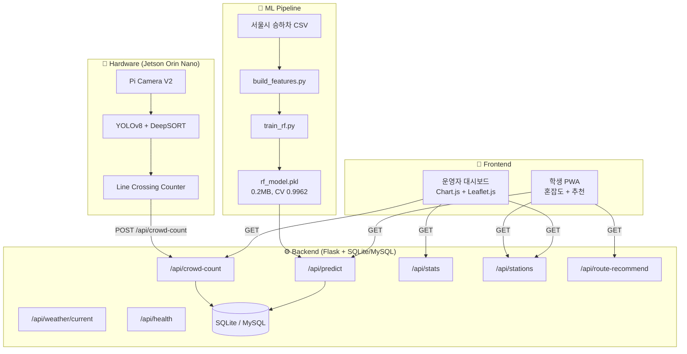

# 🚌 BUSTAGO 프로젝트 전수조사 보고서

> **조사일:** 2026-04-28 (최종 갱신: 2026-04-28 — commit `d68d9ed`)  
> **브랜치:** `feat/hunmin` (HEAD: `d68d9ed`)  
> **프로젝트:** 버스 정류장 혼잡도 예측 시스템 (RISE 캡스톤디자인)

---

## 1. 프로젝트 개요

**BUSTAGO**는 서울시 공공데이터(차내혼잡도, 승하차 이력)로 설계·검증한 **혼잡도 예측 결합 모델**을 광주대학교 셔틀/시내버스 정류장에 적용하는 시스템이다.

| 항목 | 내용 |
|------|------|
| **목표** | 정류장 대기 혼잡도 + 버스 내부 혼잡도 → 탑승 가능성 예측 |
| **사용자** | 학생(모바일 PWA) + 운영자(PC 대시보드) |
| **기간** | 2026.03 ~ 2026.06 |
| **마일스톤** | 1차 시연 5/21, 경진대회 5/28, 최종 보고서 6/4 |
| **팀** | 류훈민(팀장/AI), 박건우(현장/문서), 이트겔(백엔드), 이건영(프론트) |
| **예산** | 100만원 (하드웨어 구매 829,710원 확정) |

### 3단계 파이프라인

```
1단계: 서울시 공공데이터로 모델 구조 설계·검증  ← 완료
2단계: 광주대 인성관 셔틀 승차장 적용 (테스트베드 ①) ← 진행중
3단계: 광주대 정문 시내버스 정류장 확장 (테스트베드 ②) ← 예정
```

---

## 2. 아키텍처 & 파일 구조



### 파일 구조 요약 (소스 파일만, 총 41개)

| 디렉토리 | 파일 수 | 핵심 파일 |
|----------|:-------:|-----------|
| `backend/` | 11 | app.py, config.py, db.py, routes/(predict, crowd, stations, stats, recommend).py |
| `frontend/student/` | 5 | index.html, app.js, style.css, manifest.json, service-worker.js |
| `frontend/admin/` | 3 | index.html, dashboard.js, style.css |
| `frontend/shared/` | 1 | api.js |
| `ml/` | 8 | train_rf.py, predict.py, build_features.py, pipeline.py, 수집 스크립트 3개 |
| `hardware/` | 2 | counter.py, requirements.txt |
| `_workspace/` | 4 | ML 계약서, API 계약서, 프론트 라우트, QA 보고서 |
| `docs/` | ~25 | 계획서, 설계서, 보고서, 발표자료 등 |

---

## 3. 컴포넌트별 상세 분석

### 3.1 Backend (Flask)

[app.py](file:///home/ahble/projects/Capstone/bustago/backend/app.py) — Flask Application Factory 패턴

| 항목 | 내용 |
|------|------|
| **프레임워크** | Flask + flask-cors + flask-limiter |
| **DB** | MySQL 우선, 연결 실패 시 SQLite 자동 폴백 |
| **Rate Limit** | 200/day, 60/min (기본), 엔드포인트별 개별 설정 |
| **에러 핸들러** | 400, 404, 429, 500 전역 핸들러 |

**API 엔드포인트 (9개):**

| 엔드포인트 | 메서드 | Rate Limit | 설명 |
|-----------|--------|-----------|------|
| `/api/predict` | GET | 30/min | 혼잡도 예측 (ML 모델 호출 + 캐시) |
| `/api/crowd-count` | POST | 60/min | Jetson 카운팅 데이터 수신 |
| `/api/crowd-count` | GET | 30/min | 최신 카운팅 데이터 조회 |
| `/api/crowd-count/history` | GET | 10/min | 카운팅 이력 조회 |
| `/api/stats` | GET | 30/min | 시간대별 통계 |
| `/api/stations` | GET | 60/min | 정류장 목록 |
| `/api/weather/current` | GET | 30/min | 기상청 API 프록시 (캐시) |
| `/api/route-recommend` | GET | 20/min | 노선별 혼잡도 예측 + 대체노선 추천 |
| `/api/health` | GET | — | 헬스체크 |

**DB 테이블 (5개):** stations, predictions, weather_cache, crowd_counts, routes

> [!NOTE]
> - Predict 엔드포인트에 **5분 TTL 인메모리 캐시** 구현 (최대 500건)
> - SQLite 폴백 시 MySQL 전용 구문 자동 변환 (`_adapt_sql()`)
> - 입력 검증: `station_id` 정규식 검증, `hour` 범위 검증 등

### 3.2 Frontend

#### 학생 PWA ([student/](file:///home/ahble/projects/Capstone/bustago/frontend/student/index.html))

- **혼잡도 4단계 시각화** (🟢여유 → 🔴매우혼잡)
- **탑승 추천** ("지금 탑승" vs "다음 시간대 추천")
- **6시간 예측 바 차트**
- **출발 정류장 + 목적지 드롭다운** (광주역/금남로/충장로/정문/인성관)
- **노선별 혼잡도 추천 카드** (`/api/route-recommend` 연동, 추천 배지 표시)
- **Service Worker** 오프라인 지원
- **API 실패 시 Demo fallback** (시간대별 고정 혼잡도)
- 정류장 목록 `/api/stations`에서 **동적 로드**

#### 운영자 대시보드 ([admin/](file:///home/ahble/projects/Capstone/bustago/frontend/admin/index.html))

- **Summary 카드** (평균 혼잡도, 만차 횟수, 피크 시간, 모니터링 정류장 수)
- **실시간 카운팅 패널** (대기 인원/총 IN/총 BOARD + Jetson 연결 상태 dot — 10초 폴링)
- **Chart.js** 시간대별 바 차트 + 도넛 차트
- **Leaflet.js** 정류장 지도 (마커 색상 = 혼잡도)
- **노선별 통계 테이블**
- **60초 자동 갱신**
- API 실패 시 Demo 데이터 자동 전환

#### 공용 API 래퍼 ([shared/api.js](file:///home/ahble/projects/Capstone/bustago/frontend/shared/api.js))

- `API_BASE = window.location.origin + '/api'` (배포 환경 자동 대응)
- `fetchPredict()`, `fetchStats()`, `fetchStations()`, `fetchWeather()`, `fetchCrowdCount()`, `fetchRouteRecommend()` 6개 함수

### 3.3 ML Pipeline

#### 데이터 현황

| 데이터 | 건수 | 상태 |
|--------|------|------|
| 학습 데이터 (train_features.csv) | **14,616건** | ✅ 완료 |
| 서울 승하차 이력 (6개월) | 14,616건 | ✅ 완료 |
| 기상 데이터 | 1개 파일 | ✅ 완료 |
| 차내혼잡도 | 1개 파일 | ✅ 완료 |

**학습 데이터 컬럼 (11개):**
`hour, weekday, weather, temperature, rain, prev_boarding, prev_alighting, route_count, boarding, alighting, label`

#### 모델 ([train_rf.py](file:///home/ahble/projects/Capstone/bustago/ml/models/train_rf.py))

| 항목 | 값 |
|------|-----|
| **알고리즘** | RandomForestClassifier |
| **하이퍼파라미터** | n_estimators=10, max_depth=10, min_samples_leaf=5, max_features=sqrt |
| **사용 Feature (7개)** | hour, weekday, weather, temperature, prev_boarding, prev_alighting, route_count |
| **CV Mean Accuracy** | 0.9962 (±0.0026) |
| **모델 크기** | 0.2MB (베이스라인 5.1MB에서 96% 감소) |
| **학습 시간** | 1.2초 |

#### Autoresearch 로그 (12회 반복 실험)

[research_log.txt](file:///home/ahble/projects/Capstone/bustago/research_log.txt) — 12회 반복 실험으로 모델 최적화 완료

- Baseline(5.1MB) → **최종(0.2MB)**: 96% 크기 감소
- `rain`, `boarding`, `alighting` 3개 feature 제거 (노이즈/누수 확인)
- Phase 2에서 Codex 피드백 반영하여 leakage 검증 완료

### 3.4 Hardware ([counter.py](file:///home/ahble/projects/Capstone/bustago/hardware/counter.py))

| 항목 | 내용 |
|------|------|
| **디바이스** | Jetson Orin Nano Super Dev Kit |
| **모델** | YOLOv8n (TensorRT FP16) |
| **트래커** | DeepSORT (max_age=30, n_init=3) |
| **카운팅 방식** | Line Crossing (IN 라인 + BOARD 라인) |
| **예상 FPS** | 25~40 FPS (Jetson) |
| **서버 전송** | 10초 간격 POST `/api/crowd-count` |

**클래스 구조:**
- `LineCrossingCounter` — 가상 라인 2개(IN/BOARD) 기반 통과 판정
- `APIReporter` — 카운팅 결과를 Backend에 주기적 POST
- `run_counter()` — 메인 카운팅 루프 (CLI 파서 포함)

---

## 4. 계약서 & 정합성 현황

### QA 검증 결과 (2026-03-30 기준)

| 구분 | PASS | FAIL | WARN |
|------|:----:|:----:|:----:|
| ML 코드 vs 계약서 | 7 | 0 | 0 |
| ML ↔ Backend | 7 | 0 | 1 |
| Backend ↔ Frontend | 9 | 0 | 0 |
| E2E 데이터 흐름 | 3 | 0 | 0 |
| **합계** | **26** | **0** | **1** |

> [!WARNING]
> ### 계약서 vs 코드 불일치 발견 (전수조사 시점)
> 
> `_workspace/01_ml_model_contract.json`은 **10개 feature + n_estimators=100**으로 되어 있으나,
> 실제 코드(`train_rf.py`, `predict.py`)는 **7개 feature + n_estimators=10**으로 Autoresearch 이후 변경됨.
> 
> **계약서가 코드와 동기화되지 않은 상태.**

---

## 5. 발견된 이슈 & 리스크

### 🔴 Critical — 모두 해결 완료

| # | 이슈 | 위치 | 상태 |
|---|------|------|------|
| C1 | **ML 계약서 미동기화** | `_workspace/01_ml_model_contract.json` | ✅ **해결** — v2.0으로 갱신 (7 feature / n_estimators=10, 2026-04-28) |
| C2 | **프론트엔드 API_BASE 하드코딩** | `frontend/shared/api.js:3` | ✅ **해결** — `window.location.origin + '/api'` 적용 (2026-04-28) |

### 🟡 Warning

| # | 이슈 | 위치 | 상태 |
|---|------|------|------|
| W1 | weather=1(흐림) 미도달 | `backend/routes/stations.py` | ⚠️ 잔존 — 영향 미미, 시연에 무관 |
| W2 | predict 기본 feature 값 고정 | `backend/routes/predict.py:115-123` | ⚠️ 잔존 — 실제 날씨 연동 미완 |
| W3 | 광주 정류장 데이터 미삽입 | `backend/schema.sql` | ✅ **해결** — INS01·GATE01 + routes 테이블 추가 (2026-04-28) |
| W4 | `=3.5` 파일 존재 | 프로젝트 루트 | ✅ **해결** — 파일 삭제 (2026-04-28) |
| W5 | Docker MySQL 미포함 | `docker-compose.yml` | ⚠️ 잔존 — SQLite 폴백 의존, 시연용으로 허용 |

### 🟢 Low (참고)

| # | 이슈 | 설명 |
|---|------|------|
| L1 | 테스트 커버리지 미흡 | `backend/test_app.py` 1개만 존재. ML/Frontend 테스트 없음 |
| L2 | Service Worker 미완성 가능성 | `service-worker.js` 존재하나 캐시 전략 미확인 |
| L3 | HTTPS 미적용 | nginx.conf에 HTTP only. 시연용이므로 당장은 문제 없음 |

---

## 6. 현재 진행 상황 (5주 계획 대비)

| 주차 | 기간 | 상태 | 핵심 내용 |
|:----:|------|:----:|-----------|
| 1주차 | 4/14~4/18 | ✅/⬜ | 부품 주문 + 초기 셋업 (현재 3주차 진입) |
| 2주차 | 4/21~4/25 | ⬜ | 개별 보드 동작 검증 |
| **3주차** | **4/28~5/2** | **🔵 현재** | **실내 시연 통합 테스트** |
| 4주차 | 5/5~5/9 | ⬜ | 안정성 테스트 + 정확도 리포트 |
| 5주차 | 5/12~5/21 | ⬜ | 시범 운영 + **1차 시연 (5/21)** |

### SW 완료 현황

| 영역 | 상태 | 비고 |
|------|:----:|------|
| ML 파이프라인 | ✅ 100% | 12회 Autoresearch 완료, 모델 확정 |
| Backend API | ✅ 100% | 9개 엔드포인트 (`/api/route-recommend` 신규 포함), 테스트 PASS |
| Student PWA | ✅ 100% | 출발지/목적지 드롭다운 + 노선 추천 카드 추가 |
| Admin Dashboard | ✅ 100% | 실시간 카운팅 패널(Jetson 연결 상태) + 60초 갱신, 차트, 지도 |
| AI 카운팅 코드 | ✅ 100% | YOLOv8+DeepSORT+Line Crossing |
| Docker 배포 | ✅ 100% | nginx → backend 구성 |

### HW 잔여 작업

| 항목 | 상태 |
|------|:----:|
| 부품 구매 (829,710원) | ⬜ 대기 |
| Jetson JetPack 설치 | ⬜ 대기 |
| Pi Kiosk 설치 | ⬜ 대기 |
| 카메라 연결 테스트 | ⬜ 대기 |
| 실내 시연 환경 구성 | ⬜ 대기 |
| 정확도 튜닝 | ⬜ 대기 |

---

## 7. Git 현황

| 항목 | 값 |
|------|-----|
| **현재 브랜치** | `feat/hunmin` |
| **브랜치** | main, develop, feat/hunmin |
| **최근 커밋** | `d68d9ed` — feat: 대체노선 추천 API + Admin 카운팅 패널 + 광주 정류장 데이터 |
| **총 커밋** | 25+ |
| **커밋 패턴** | `docs:` 문서 갱신 위주, `feat:` AI 카운팅/Docker 등 |

---

## 8. 종합 평가

### 강점
- **SW 완성도 높음**: 전 계층(ML→Backend→Frontend) 코드 완성, QA 26/26 PASS (Critical 이슈 2건 모두 해결)
- **계약서 기반 개발**: ML 모델 계약서 v2.0, API 계약서로 인터페이스 명확히 정의
- **ML 최적화 충실**: 12회 Autoresearch로 모델 96% 경량화 달성
- **Demo fallback 전략**: API 실패 시 프론트엔드 자체 Demo 데이터 표시
- **대체노선 추천 기능**: 광주대 정류장 기준 노선별 혼잡도 예측 + 추천 배지 UI 완성
- **문서화 충실**: 25+ 문서, 5주 실행 계획, 리스크 대응 담당 지정

### 개선 필요
- **계약서 동기화**: ML 계약서가 Autoresearch 결과 미반영
- **배포 설정**: API_BASE 하드코딩, 광주 정류장 데이터 미등록
- **predict 실시간 연동**: 날씨/실제 승하차 데이터 연동 부재 (기본값 사용)
- **테스트**: 자동화 테스트 부족 (backend 1건만)

> **현재 시점 판단:** SW는 100% 완료. **HW 셋업 + 실내 시연 통합**이 남은 핵심 작업이며, 5/21 시연까지 약 3주 남아 일정은 타이트하지만 실행 가능한 상태.
