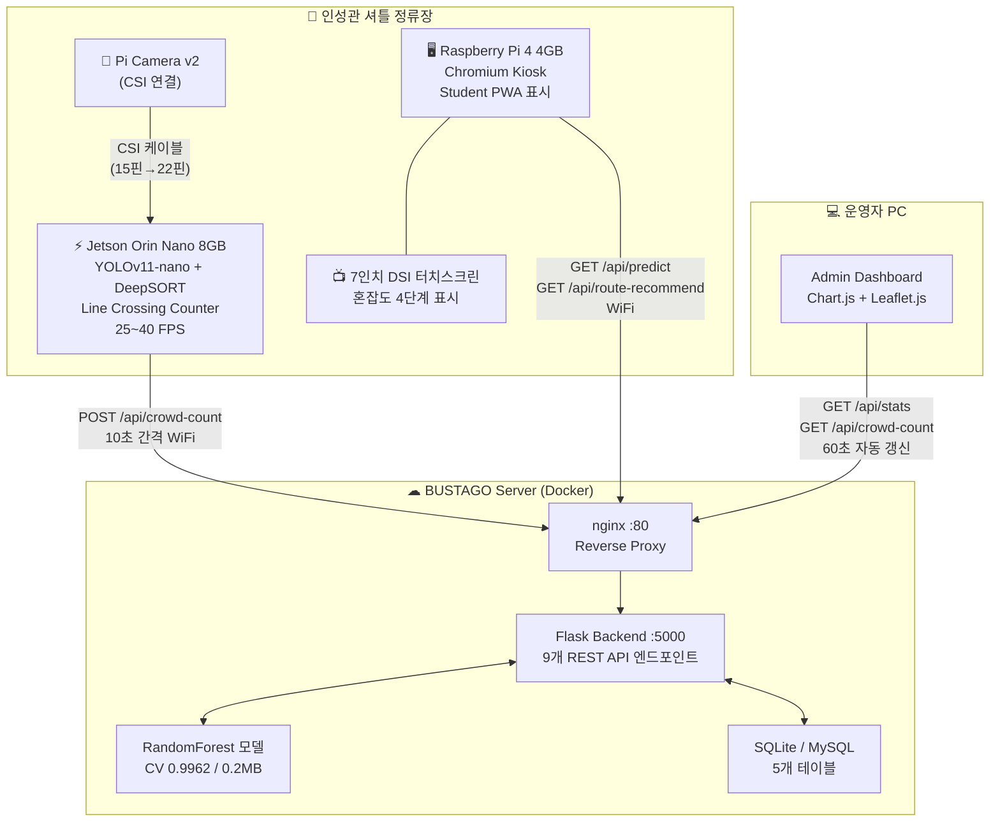

# BUSTAGO 하드웨어 시스템 개념도

> **작성일:** 2026-04-29 | **최종 수정:** 2026-05-07
> **버전:** v2.0
> **변경 이력:** v1.0 YOLOv11/RF 기준 → v2.0 YOLOv11/LightGBM 전환, 카메라 설치 방식 변경 (2026-05-07 회의)

---

## 1. 시스템 전체 개념도



---

## 2. Raspberry Pi → Jetson Orin Nano 전환 근거

### 2.1 핵심 이유: 중복 카운팅 방지 불가

Pi 4는 CPU 기반으로 YOLOv11 추론 시 **2~5 FPS**에 불과하다.  
이 속도에서는 DeepSORT 트래커가 프레임 간 같은 사람을 **동일 객체로 연속 추적하지 못해**, 한 사람이 여러 번 카운팅되는 **중복 카운팅** 문제가 발생한다.

```
[Pi 4 문제 재현]

프레임 1: Person A 탐지 → Track #1 생성
프레임 2: (5 FPS에서 200ms 공백) → 위치 이동 큼 → IoU 매칭 실패
          → Track #1 소멸, Track #2 신규 생성 (= 같은 사람을 다른 사람으로 인식)

결과: Person A가 정류장에 1명 들어왔지만 카운트 = 2 (중복)
```

### 2.2 Jetson에서 해결

Jetson GPU(1024 CUDA 코어)에서 TensorRT FP16 엔진으로 **25~40 FPS** 달성.  
고 FPS에서는 프레임 간 이동이 몇 픽셀에 불과하므로 DeepSORT의 IoU 매칭과 칼만 필터가 정확히 동작한다.

```
[Jetson 해결 방식]

프레임 1: Person A 탐지 → Track #1 (고유 ID)
프레임 2: (25 FPS에서 40ms 공백) → 위치 이동 작음 → IoU 매칭 성공
          → Track #1 유지 (= 동일 인물로 연속 추적)
프레임 N: Line Crossing 통과 → Track #1 단 1회만 카운트
          동일 Track ID의 재통과는 무시

결과: Person A가 정류장에 1명 들어오면 카운트 = 1 (정확)
```

### 2.3 변경 비교표

| 항목 | Pi 4 Only (구안) | Jetson + Pi 4 (현안) |
|------|-----------------|---------------------|
| AI 추론 보드 | Pi 4 (CPU) | **Jetson Orin Nano** (GPU) |
| 추론 FPS | 2~5 FPS | **25~40 FPS** |
| DeepSORT 트래킹 | 사실상 불가 | **실시간 가능** |
| 중복 카운팅 방지 | ❌ 불가 | **✅ Track ID로 방지** |
| 카메라 필요 수 | 3대 (저 FPS 보상) | **1대 (고 FPS로 충분)** |
| 키오스크 안정성 | AI 부하와 경합 | **독립 보드, 안정적** |
| 예산 | 750,000원 | **913,300원 (시연 기준)** |

> **핵심:** Pi 4로는 DeepSORT 중복 카운팅 방지 구현이 **기술적으로 불가능**하므로 Jetson 전환이 필수였음.

---

## 3. 보드별 역할 분리

```
┌─────────────────────────────┐     ┌─────────────────────────────┐
│      Jetson Orin Nano       │     │       Raspberry Pi 4        │
│         (AI 전용)           │     │       (키오스크 전용)        │
├─────────────────────────────┤     ├─────────────────────────────┤
│ • YOLOv11-nano 추론 (GPU)    │     │ • Chromium --kiosk 모드     │
│ • DeepSORT 트래킹 (CUDA)    │     │ • Student PWA 표시          │
│ • Line Crossing 카운팅      │     │ • 60초 자동 갱신            │
│ • POST /api/crowd-count     │     │ • Service Worker (오프라인) │
│                             │     │                             │
│ GPU: 1024 CUDA 코어         │     │ CPU 전용 (AI 불필요)        │
│ 메모리: 8GB LPDDR5          │     │ 메모리: 4GB                 │
└──────────┬──────────────────┘     └──────────┬──────────────────┘
           │                                    │
           └──────────── WiFi → Server ─────────┘
```

**분리 이유:** Jetson에서 AI 추론과 Chromium을 동시 실행 시 GPU 메모리 경합 발생 → AI 성능 저하.  
Pi 4를 키오스크 전용으로 분리해 각 보드가 단일 역할에 집중.

---

## 4. 데이터 흐름

```
[AI 카운팅 경로]
Pi Camera v2 (30 FPS 캡처)
    → Jetson: YOLOv11-nano 탐지 (25~40 FPS)
    → DeepSORT: Track ID 부여 + 칼만 필터 예측
    → Line Crossing: IN/BOARD 라인 통과 시 해당 Track ID 1회 카운트
    → 10초 간격: POST /api/crowd-count → Backend DB 저장

[키오스크 표시 경로]
Pi 4 Chromium Kiosk
    → GET /api/predict?station_id=INS01&hour={현재시각}
    → 혼잡도 4단계 + 탑승 추천 표시
    → GET /api/route-recommend → 노선별 혼잡도 카드 표시
    → 60초 후 자동 갱신

[운영자 모니터링 경로]
Admin Dashboard
    → GET /api/crowd-count → 실시간 카운팅 패널 (10초 폴링)
    → GET /api/stats → 시간대별 차트 (60초 갱신)
    → Jetson staleness 판정: created_at 기준 60초 초과 시 "연결 끊김" 표시
```

---

## 5. 기술 스택 요약

| 레이어 | 보드 | 기술 |
|--------|------|------|
| AI 추론 | Jetson Orin Nano | JetPack 6.x, YOLOv11-nano TensorRT FP16, DeepSORT, OpenCV(CUDA) |
| 키오스크 | Raspberry Pi 4 | Pi OS Lite 64-bit, Chromium --kiosk, systemd |
| Backend | 서버 (Docker) | Flask, SQLite/MySQL, nginx, Flask-Limiter, LRU TTL Cache |
| ML 모델 | 서버 | LightGBM (n=300, depth=6, lr=0.05), 7 feature, CV 0.934, 1.7MB |
| Frontend | 브라우저/PWA | Vanilla JS, Chart.js, Leaflet.js, Service Worker |

---

## 참고

- [NVIDIA Jetson Orin Nano Specs](https://www.nvidia.com/en-us/autonomous-machines/embedded-systems/jetson-orin/) — 40 TOPS, 1024 CUDA
- [DeepSORT Paper](https://arxiv.org/abs/1703.07402) — Simple Online and Realtime Tracking with a Deep Association Metric
- [YOLOv11 Jetson Benchmarks](https://docs.ultralytics.com/guides/nvidia-jetson/) — YOLOv11n TensorRT FP16 ≈ 40 FPS on Jetson Orin Nano
