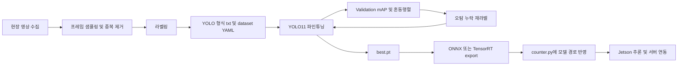

# HUNMINRYU bustago feat hunmin 브랜치 객체 탐지 학습 분석 보고서

## 핵심 요약

`feat/hunmin` 브랜치는 이미 **YOLOv11 + DeepSORT 기반 Jetson 추론·카운팅 경로**를 갖고 있습니다. 루트 README, 하드웨어 설치 문서, 하드웨어 설계 문서는 모두 Jetson Orin Nano에서 YOLOv11-nano를 TensorRT 엔진으로 내보내고, DeepSORT와 라인 크로싱으로 정류장 대기 인원을 실시간 집계하는 구조를 일관되게 설명합니다. 그러나 이 브랜치에는 **객체 탐지 학습용 데이터셋 YAML, 라벨 변환 스크립트, 모델 정의 YAML, 학습 엔트리포인트**가 확인되지 않았고, `ml/` 디렉터리는 별도의 **LightGBM/RandomForest 혼잡도 예측 파이프라인**입니다. 즉, 현재 상태는 “객체 탐지 모델을 학습하는 저장소”라기보다 “객체 탐지 추론을 시스템에 연결한 저장소”에 가깝습니다. fileciteturn14file0L3-L3 fileciteturn16file0L3-L3 fileciteturn21file0L3-L3 fileciteturn9file0L3-L3

따라서 가장 현실적인 전략은 기존 하드웨어 배포 구조를 유지한 채, **학습 경로만 별도 추가**하는 것입니다. 구체적으로는 `hardware/` 아래 또는 독립 `scripts/` 아래에 YOLO11 학습 스크립트와 데이터셋 YAML을 추가하고, `counter.py`의 **사람 클래스 하드코딩**과 `"person"` 라벨 고정을 제거하면 됩니다. 이렇게 하면 기존 Jetson 추론 경로는 거의 그대로 유지하면서도, 사용자 요청처럼 **버스/차량 검출용 YOLOv11 파인튜닝**을 수행할 수 있습니다. fileciteturn11file0L3-L3 fileciteturn12file0L3-L3 fileciteturn13file0L3-L3 citeturn4view0turn4view1turn8view0

다만 중요한 해석이 하나 있습니다. 저장소의 실제 비즈니스 목표는 현재 **버스 자체 검출**이 아니라 **정류장 대기 인원 카운팅**입니다. README와 정확도 리포트 템플릿은 `count_in`, `count_board`, `current_waiting` 같은 **사람 흐름 KPI**를 전제로 하고 있습니다. 따라서 “버스/차량 detection”을 학습하더라도, 그 결과가 곧바로 현재 서버의 `crowd-count` API 의미론과 맞지는 않습니다. 만약 목적이 정류장 혼잡도라면, 실제로 먼저 개선해야 할 모델은 **사람 검출**일 가능성이 높고, 버스/차량 검출은 보조 태스크 또는 별도 엔드포인트가 더 자연스럽습니다. fileciteturn14file0L3-L3 fileciteturn17file0L3-L3

## 저장소와 브랜치 분석

`feat/hunmin` 브랜치의 저장소 구조는 크게 `backend`, `frontend`, `ml`, `hardware`, `docs`로 나뉘며, 여기서 객체 탐지와 직접 연결되는 부분은 사실상 `hardware/`와 이를 설명하는 `docs/03_구축`, `docs/04_테스트`입니다. 반면 `ml/`은 서울시 공공데이터 기반 혼잡도 예측을 위한 LightGBM/RandomForest 학습·추론 경로로 문서화되어 있습니다. 다시 말해, 객체 탐지 학습 체계는 분리되어 있지 않으며, 브랜치의 객체 탐지는 시스템 통합 관점에서 **현장 카운팅 모듈**로 다뤄집니다. fileciteturn14file0L3-L3 fileciteturn9file0L3-L3

아래 표는 객체 탐지 학습과 관련해 실제로 의미 있는 파일만 추린 **파일 단위 맵**입니다.

| 경로 | 현재 역할 | 객체 탐지 학습 관점의 의미 | 핵심 파라미터·포인트 | 근거 |
|---|---|---|---|---|
| `README.md` | 프로젝트 전체 구조와 실행법 설명 | 하드웨어 경로가 `counter.py` 중심의 Jetson 카운팅이며, 실행 예시에 `yolo11n.pt`와 `yolo11n.engine`이 등장 | `python counter.py --model yolo11n.pt`, Jetson 배포 시 `.engine` 사용 | fileciteturn14file0L3-L3 |
| `hardware/README.md` | 하드웨어 모듈 설명 | YOLOv11 + DeepSORT 기반 실시간 카운팅 모듈이라는 점을 명시 | 추론/서버 전송/디버그 실행 경로 | fileciteturn10file0L3-L3 |
| `hardware/counter.py` | 실제 추론·트래킹·POST 루프 | **현재 저장소의 핵심 객체 탐지 코드**. 다만 학습 루틴은 없고, 사람 검출 중심으로 설계됨 | `YOLO(args.model)` 기반 로딩, DeepSORT 추적, 라인 크로싱, 서버 POST, 사람 클래스 중심 처리 | fileciteturn11file0L3-L3 fileciteturn12file0L3-L3 |
| `hardware/requirements.txt` | 하드웨어 의존성 | YOLOv11 호환은 가능하지만 재현성은 낮음 | `ultralytics>=8.0.0`, `deep-sort-realtime`, `opencv-python`, `requests`, `numpy` | fileciteturn13file0L3-L3 |
| `docs/03_구축/HW_설치_가이드_Part1_Jetson.md` | Jetson 설치와 엔진 변환 가이드 | YOLOv11를 실제 배포 대상으로 상정하고 있음 | JetPack 6.x, CUDA 12.x, `YOLO('yolo11n.pt')`, `model.export(format='engine', half=True, imgsz=640)` | fileciteturn16file0L3-L3 |
| `docs/03_구축/하드웨어_연동_설계.md` | 시스템·카메라·데이터 흐름 설계 | 객체 탐지 태스크가 “버스/차량”보다 “사람 카운팅”에 맞춰져 있음을 보여줌 | 1카메라, 640×480, 30 FPS, 25~40 FPS, YOLOv11-nano + DeepSORT + Line Crossing | fileciteturn21file0L3-L3 |
| `docs/04_테스트/AI_카운팅_정확도_리포트_템플릿.md` | 현장 검증 템플릿 | 최종 KPI가 mAP가 아니라 **IN/BOARD/대기인원 오차율**임을 보여줌 | 목표 기준: IN 오차율 ≤ 10%, BOARD 오차율 ≤ 15% | fileciteturn17file0L3-L3 |
| `ml/README.md` | 혼잡도 예측 파이프라인 설명 | 객체 탐지 학습과 분리된 별도 ML 경로라는 점을 명확히 함 | `train_lgbm.py`, `train_rf.py`, `predict.py` | fileciteturn9file0L3-L3 |

이 파일 맵에서 가장 중요한 결론은 단순합니다. **객체 탐지 “추론”은 존재하지만, 객체 탐지 “학습”은 없다**는 점입니다. 특히 브랜치 전체 문맥상 `hardware/counter.py`는 사람 탐지 기반의 혼잡도 계수기이며, 학습 기능이 없어도 돌아가도록 설계되어 있습니다. 반대로 `ml/`은 객체 탐지가 아닌 혼잡도 예측 모델 학습용입니다. 따라서 사용자가 요청한 YOLOv11 학습은 저장소에 이미 있는 구조를 “활용”해야 하지만, 그대로는 불가능하고 **학습층을 덧붙이는 방식**이 필요합니다. fileciteturn11file0L3-L3 fileciteturn12file0L3-L3 fileciteturn9file0L3-L3

또 하나 주의할 점은 문서 드리프트입니다. 루트 README와 Jetson 설치 문서는 분명히 YOLOv11을 전제로 하지만, 아키텍처 종합진단 문서 일부는 하드웨어 스택을 여전히 **YOLOv8**으로 기술합니다. 이건 코드가 YOLOv11로 전환된 뒤 문서 일부가 갱신되지 않은 흔적으로 보이며, 브랜치 분석 시 “현재 코드”와 “문서 기록”을 분리해 읽어야 한다는 뜻입니다. fileciteturn14file0L3-L3 fileciteturn16file0L3-L3 fileciteturn18file0L3-L3

## YOLOv11 호환성 판단과 개조안

판단부터 말하면, 이 브랜치는 **YOLOv11을 이미 참조하고 있으며, 런타임 관점에서는 충분히 호환**됩니다. 저장소 문서가 `yolo11n.pt`와 `yolo11n.engine`를 직접 예시로 들고 있고, `counter.py`는 Ultralytics의 범용 `YOLO()` API를 사용합니다. Ultralytics 공식 문서도 YOLO11이 **Detection에서 Inference, Validation, Training, Export를 모두 지원**한다고 명시하며, `.pt` 가중치와 `.yaml` 구성 파일을 `YOLO()`에 넘겨 사용할 수 있다고 설명합니다. fileciteturn14file0L3-L3 fileciteturn16file0L3-L3 fileciteturn13file0L3-L3 citeturn4view0

다만 **호환**과 **학습 준비 완료**는 다릅니다. 공식 YOLO11 문서는 `model = YOLO("yolo11n.pt")` 후 `model.train(data="coco8.yaml", epochs=100, imgsz=640)` 같은 흐름을 제시하지만, `feat/hunmin` 브랜치에는 그 `data=...yaml`에 해당하는 데이터셋 정의 파일 자체가 없습니다. 라벨 포맷도 브랜치에는 명시적 정의가 없고, 학습을 시작하는 CLI 또는 Python 엔트리포인트도 보이지 않습니다. 결국 현재 브랜치는 YOLO11 **추론 호환 브랜치**이지, YOLO11 **학습 호환 브랜치**는 아닙니다. citeturn4view0turn4view1turn15view0 fileciteturn11file0L3-L3 fileciteturn14file0L3-L3

가장 큰 구조적 문제는 `counter.py`가 **사람 검출용 의미론을 강하게 내장**하고 있다는 점입니다. 이 코드는 정류장 진입선과 탑승선을 기준으로 `IN`, `BOARD`, `현재 대기 인원`을 세기 때문에, 사용자 요청대로 버스/차량 검출 모델을 학습하더라도 현재 서버 API와 바로 맞물리지는 않습니다. 다시 말해, 버스 검출을 하고 싶다면 바뀌어야 하는 것은 모델 가중치만이 아니라 **카운팅 정의, 라벨 이름, 필터 클래스, 서버 payload**까지입니다. 반대로 프로젝트 본래 목적이 정류장 혼잡도라면 버스보다 **사람 검출을 커스텀 파인튜닝**하는 편이 더 직접적인 개선입니다. fileciteturn17file0L3-L3 fileciteturn21file0L3-L3 fileciteturn11file0L3-L3 fileciteturn12file0L3-L3

그래서 권장 개조 방향은 두 갈래입니다.  
첫째, **버스/차량 검출 실험용**으로 갈 경우에는 `counter.py`에 클래스 ID를 외부 인자로 넣을 수 있게 만들고, `"person"` 문자열을 실제 클래스명으로 치환해야 합니다. COCO 기준으로 Ultralytics 예시 YAML은 `car=2`, `motorcycle=3`, `bus=5`, `truck=7`로 정의합니다. 따라서 COCO 사전학습 모델을 그대로 쓸 때는 `--classes 5`가 bus, `--classes 2,5,7`이 도로 차량 묶음이 됩니다. 둘째, **혼잡도 시스템 개선용**으로 갈 경우에는 사람 클래스 중심으로 커스텀 데이터셋을 만들어 `person` 검출을 파인튜닝하고, 이후 DeepSORT와 라인 크로싱 정확도를 함께 끌어올리는 편이 저장소의 현재 목적과 더 정확히 맞습니다. citeturn15view0turn5view1 fileciteturn11file0L3-L3 fileciteturn12file0L3-L3



실제 코드 변경은 크지 않습니다. 핵심은 네 가지입니다.  
첫째, `hardware/train_yolo.py` 또는 `scripts/train_yolo.py`를 추가합니다.  
둘째, `hardware/configs/bustago_bus.yaml` 같은 데이터셋 YAML을 추가합니다.  
셋째, `counter.py`에 `--classes` 인자를 넣고, 결과 라벨을 하드코딩 `"person"`에서 동적으로 바꿉니다.  
넷째, 버스/차량 검출을 실제 서비스에 반영한다면 `crowd-count` API 대신 별도 `vehicle-detect` 성격의 schema를 추가하는 편이 맞습니다. 이 마지막 단계는 저장소의 현재 데이터 의미가 사람 수 집계에 묶여 있기 때문에 필요합니다. fileciteturn17file0L3-L3 fileciteturn11file0L3-L3 fileciteturn12file0L3-L3

권장 의존성은 “학습용 x86 환경”과 “배포용 Jetson 환경”을 분리하는 방식입니다. x86 학습기에 대해서는 PyTorch 공식 페이지가 Python 3.10 이상을 요구하고, PyTorch 2.5.1 조합으로 `torch==2.5.1`, `torchvision==0.20.1`, `torchaudio==2.5.1`, CUDA 12.1 wheel을 제공합니다. 반면 Jetson Orin Nano 배포 쪽은 NVIDIA JetPack 6.1이 Ubuntu 22.04, CUDA 12.6, TensorRT 10.3, cuDNN 9.3을 포함하고, Ultralytics Jetson 가이드는 JetPack 6.1에서 `ultralytics[export]` 설치 후 ARM64용 PyTorch/Torchvision wheel을 별도로 맞추라고 안내합니다. 즉, **학습은 x86 GPU**, **배포는 Jetson에서 export 및 inference**가 가장 안전합니다. citeturn10view1turn10view2turn10view5turn11view0turn15view1turn15view2

덧붙이면, Ultralytics는 YOLO11에 대해 **정식 연구 논문을 내지 않았다**고 공식 문서에 적고 있습니다. 따라서 YOLO11 구조와 사용법의 1차 출처는 논문이 아니라 Ultralytics 공식 문서와 코드입니다. 이 점은 보고서의 나머지 권장안이 대부분 “공식 문서 기반 운용 레시피”에 기대는 이유이기도 합니다. citeturn4view0

## 권장 학습 계획

환경은 세 가지 규모로 나누는 것이 실용적입니다. 소규모는 단일 8–12GB GPU에서 `yolo11n` 또는 `yolo11s`, 중규모는 16–24GB GPU에서 `yolo11s` 또는 `yolo11m`, 대규모는 24GB 이상 또는 다중 GPU에서 `yolo11m` 이상을 권합니다. 공식 YOLO11 페이지는 `yolo11n`부터 `yolo11x`까지 감지용 모델 계열을 제공하고, 훈련 설정 문서는 기본 `epochs=100`, `batch=16`, `imgsz=640`, `save=True`, `workers=8`을 제시합니다. 이 기본값을 출발점으로 하되, 버스 정류장처럼 작은 원거리 객체가 섞이면 `imgsz`를 960 전후까지 올리는 것이 보통 유리합니다. 이는 공식 문서의 기본값을 유지하면서도 실제 장면의 거리 분포에 맞춘 운영적 권장입니다. citeturn4view0turn15view3turn15view4

데이터 포맷은 Ultralytics YOLO 형식을 그대로 따르는 것이 가장 단순합니다. 공식 문서는 이미지당 하나의 `*.txt` 라벨 파일을 두고, 각 행을 `class x_center y_center width height`의 **정규화된 xywh**로 적으라고 설명합니다. 객체가 없는 이미지에는 라벨 파일이 필요하지 않으며, COCO나 COCO-style JSON은 `convert_coco()`로 변환할 수 있습니다. 즉, 이미 다른 프로젝트에서 COCO JSON으로 받은 라벨이 있다면 새 파서를 만드는 대신 Ultralytics 변환기를 쓰는 편이 맞습니다. citeturn5view1turn15view0

전처리는 기술적으로는 단순하지만 운영적으로 훨씬 중요합니다. 버스/차량 검출이라면 **카메라 위치별 분할 누수**, **연속 프레임 과중복**, **낮/밤/비/역광 쏠림**, **정류장 광고판·표지판 배경 오탐**, **버스 후면/측면/부분 가림 비율 부족**이 보통 성능을 크게 깎습니다. 따라서 단순 무작위 분할보다, 카메라·날짜·시간대 기준으로 train/val/test를 분리하고, 테스트셋에는 현장 최종 배포 장면을 남겨두는 것이 좋습니다. 이 부분은 공식 문서의 형식 요구사항 위에 얹는 운영 원칙입니다. citeturn5view1turn15view0

증강은 기본값에서 크게 벗어날 필요가 없습니다. Ultralytics 훈련 문서는 기본적으로 `hsv_h=0.015`, `hsv_s=0.7`, `hsv_v=0.4`, `translate=0.1`, `scale=0.5`, `fliplr=0.5`, `mosaic=1`, `mixup=0`, `cutmix=0`, `close_mosaic=10`을 제시합니다. 버스 정류장 고정 카메라처럼 시점이 비교적 일정한 경우에는 `degrees`를 0~3 정도의 작은 값으로 두고, `flipud`는 거의 0으로 두는 편이 자연스럽습니다. 반대로 도로 차량을 다양한 폰카·CCTV 시점에서 모았다면 공식 기본값에 가깝게 유지하는 편이 일반화에 유리합니다. citeturn15view4turn6view2turn6view3turn6view4turn6view5

학습률 스케줄은 별도 커스텀보다 공식 기본값을 먼저 따르는 것이 좋습니다. Ultralytics 문서는 `lr0=0.01`, `lrf=0.01`, `momentum=0.937`, `weight_decay=0.0005`, `warmup_epochs=3.0`, `amp=True`, `patience=100`을 기본값으로 둡니다. 버스/차량 데이터가 몇 천 장 수준이라면 `cos_lr=True`, `patience=30~50`, `close_mosaic=10`, `pretrained=True` 정도만 추가해도 충분합니다. 데이터가 아주 적다면 `freeze`를 써서 초반 backbone을 부분 고정하는 전이학습 전략이 안전합니다. citeturn6view0turn6view1turn6view2turn6view6turn6view7

체크포인팅과 평가는 학습 계획의 일부로 묶어야 합니다. 공식 문서는 epoch마다 체크포인트를 저장하고, `save_period`로 추가 저장 주기를 제어할 수 있다고 설명합니다. 검증 단계에서는 `mAP50`, `mAP75`, `mAP50-95`뿐 아니라 per-image precision/recall/F1, TP/FP/FN, confusion matrix, plots를 직접 뽑을 수 있습니다. 따라서 이 저장소처럼 최종 목표가 현장 카운팅 오차인 시스템에서는 **객체 검출 mAP**와 **실제 운영 카운팅 오차**를 분리해서 둘 다 봐야 합니다. citeturn6view6turn7view0

아래는 이 브랜치에 가장 자연스럽게 붙일 수 있는 **최소 설정 예시**입니다. 설명은 모두 현재 repo 구조와 Ultralytics 기본 인터페이스를 따릅니다. fileciteturn14file0L3-L3 fileciteturn13file0L3-L3 citeturn4view0turn4view1turn15view0

```bash
# x86 학습 환경 예시
python -m venv .venv
source .venv/bin/activate

pip install --upgrade pip
pip install torch==2.5.1 torchvision==0.20.1 torchaudio==2.5.1 --index-url https://download.pytorch.org/whl/cu121
pip install ultralytics opencv-python numpy requests
```

```yaml
# hardware/configs/bustago_bus.yaml
path: datasets/bustago_bus
train: images/train
val: images/val
test: images/test

names:
  0: bus
  1: car
  2: truck
  3: motorcycle
```

```yaml
# hardware/configs/train_bus.yaml
model: yolo11s.pt
data: hardware/configs/bustago_bus.yaml

epochs: 100
imgsz: 960
batch: 16
device: 0
workers: 8

pretrained: true
optimizer: auto
lr0: 0.01
lrf: 0.01
cos_lr: true
warmup_epochs: 3
weight_decay: 0.0005

cache: ram
save: true
save_period: 10
patience: 40

hsv_h: 0.015
hsv_s: 0.7
hsv_v: 0.4
translate: 0.1
scale: 0.5
fliplr: 0.5
mosaic: 1.0
mixup: 0.0
close_mosaic: 10

project: runs/bustago
name: yolo11-bus
```

```python
# hardware/train_yolo.py
from ultralytics import YOLO

if __name__ == "__main__":
    model = YOLO("yolo11s.pt")
    model.train(
        data="hardware/configs/bustago_bus.yaml",
        epochs=100,
        imgsz=960,
        batch=16,
        device=0,
        workers=8,
        pretrained=True,
        cos_lr=True,
        lr0=0.01,
        lrf=0.01,
        close_mosaic=10,
        cache="ram",
        project="runs/bustago",
        name="yolo11-bus",
    )
```

```bash
# CLI 학습
yolo detect train \
  model=yolo11s.pt \
  data=hardware/configs/bustago_bus.yaml \
  epochs=100 \
  imgsz=960 \
  batch=16 \
  device=0 \
  workers=8 \
  cos_lr=True \
  close_mosaic=10 \
  project=runs/bustago \
  name=yolo11-bus
```

```bash
# 검증
yolo detect val \
  model=runs/bustago/yolo11-bus/weights/best.pt \
  data=hardware/configs/bustago_bus.yaml \
  imgsz=960 \
  batch=16 \
  plots=True
```

```bash
# 추론
yolo detect predict \
  model=runs/bustago/yolo11-bus/weights/best.pt \
  source=sample_images \
  conf=0.25
```

```bash
# Jetson 배포용 export
yolo export \
  model=runs/bustago/yolo11-bus/weights/best.pt \
  format=engine \
  imgsz=640 \
  half=True
```

마지막으로 `counter.py`는 최소한 아래 정도는 고쳐야 합니다. 현재 저장소는 사람 검출을 전제로 하므로, 클래스 ID를 입력받고 실제 클래스명을 넘기도록 만드는 것이 핵심입니다. COCO 사전학습 모델을 그대로 쓰면 `bus=5`라는 점을 기억하면 되고, 커스텀 버스 전용 데이터셋이라면 클래스 0이 bus가 됩니다. citeturn15view0 fileciteturn11file0L3-L3 fileciteturn12file0L3-L3

```python
# counter.py에 추가할 최소 변경 예시

parser.add_argument("--classes", default="0", help="comma-separated class ids")

target_classes = [int(x) for x in args.classes.split(",") if x.strip()]

results = model(frame, classes=target_classes, verbose=False, conf=args.conf)

for box in results[0].boxes:
    cls_id = int(box.cls[0])
    cls_name = model.names.get(cls_id, str(cls_id))
    x1, y1, x2, y2 = map(int, box.xyxy[0].tolist())
    conf = float(box.conf[0])

    detections.append(([x1, y1, x2 - x1, y2 - y1], conf, cls_name))
```

## 데이터 소싱과 관련 사례

공개 데이터는 “정확한 버스 정류장 현장 장면”과 “범용 도로 차량 다양성” 사이에서 균형을 잡아야 합니다. 버스 정류장 현장처럼 고정 카메라, 부분 가림, 역광, 군집 장면이 많은 환경은 COCO만으로는 부족하고, 교통 CCTV나 자율주행 도로 데이터셋이 더 잘 맞습니다. 아래 표는 실무적으로 우선 검토할 가치가 높은 공개 데이터셋과 한국어권 유사 프로젝트를 함께 정리한 것입니다. 라이선스가 공식 페이지에서 명확히 드러나는 경우는 그대로 표기했고, 이번 조사 경로에서 명확히 확인되지 않은 경우는 “공식 약관 재확인”으로 남겼습니다. citeturn12academia2turn37view0turn17view1turn35view0turn29academia0turn30view0 fileciteturn22file0L3-L3 fileciteturn23file0L3-L3

| 유형 | 이름 | 설명 | 라이선스/이용조건 | 규모 | 클래스 | BUSTAGO 적합성 |
|---|---|---|---|---|---|---|
| 국제 데이터셋 | COCO | 범용 객체 탐지 표준. 버스·차·트럭·사람이 모두 포함된 가장 쉬운 스타트 포인트 | 공식 약관 재확인 필요 | 328k 이미지, 2.5M labeled instances, 91 object types | Ultralytics 예시 기준 `bus`, `car`, `truck`, `person` 포함 | 초반 transfer learning 용으로 매우 좋지만, 정류장 CCTV 도메인 적합성은 제한적임. citeturn12academia2turn15view0 |
| 국제 데이터셋 | Open Images V4 | 대규모 공개 이미지 데이터셋. object detection용 600 클래스, 복잡한 장면 다양성 큼 | Creative Commons Attribution | 9.2M images, 15.4M boxes, detection 기준 1.9M images/600 classes | 600 object classes | 드문 차량 유형과 배경 다양성 확보에 유리하나, 라벨 정제 비용이 큼. citeturn37view0 |
| 국제 데이터셋 | Cityscapes | 도시 도로 장면 중심. 차량/사람 instance segmentation과 도심 맥락이 강점 | 비상업적 사용 허용, license terms 동의 필요 | 5,000 fine + 20,000 coarse, 50 cities | 30 classes, vehicles에 `car`, `truck`, `bus`, `motorcycle`, `bicycle` 포함 | 버스 정류장처럼 도시 도로 맥락이 중요할 때 좋음. 다만 검출보다 segmentation/scene understanding 쪽 성격이 강함. citeturn17view1turn36view0turn32view1 |
| 국제 데이터셋 | MIO-TCD | 교통 카메라 장면 전용 벤치마크. localization dataset이 특히 실무적 | CC BY-NC-SA 4.0 | 총 786,702 images, localization 137,743 high-res images | `bus`, `car`, `pickup truck`, `single unit truck`, `work van` 등 11 labels | CCTV 시점 차량 검출에 매우 유용. BUSTAGO의 고정 카메라 환경과 잘 맞는 편. citeturn17view3turn35view0 |
| 국제 데이터셋 | UA-DETRAC | 교통 장면 다중 객체 검출·추적 벤치마크 | 공식 약관 재확인 | 100 sequences, 140k+ frames | vehicle category, occlusion, weather, truncation, vehicle bounding boxes | 추적·계수 관점까지 포함해 보기 좋지만, 버스 클래스 분리 활용은 추가 확인이 필요함. citeturn29academia0 |
| 국제 데이터셋 | BDD100K | 100K 비디오와 10개 태스크를 가진 대규모 자율주행 데이터셋 | 공식 약관 재확인 | 100K videos | 도심 주행 객체 전반, 세부 detection 클래스는 공식 문서 재확인 권장 | 다양한 날씨·지역·시간대 일반화에 유리. 버스 정류장 고정카메라 도메인과는 차이가 있음. citeturn30view0 |
| 한국어권 유사 프로젝트 | 뻐정 | 광주 버스 혼잡도 예측 프로젝트. SSD + TensorRT FP16 + LightGBM 결합 | 프로젝트 문서 기준 공개 사례, 별도 코드/사이트 출처 기재 | 약 200만 건 데이터 활용 언급 | 대기 인원 카운팅 + 수요 예측, 3단계 혼잡도 | BUSTAGO와 문제정의가 가장 유사. 단, 추적 부재와 SSD 사용은 현재 기준 한계. fileciteturn22file0L3-L3 |
| 한국어권 유사 프로젝트 | 부산대 캡스톤 | Jetson TX2에서 YOLOv5 + DeepSORT로 버스 승하차 인원 및 사고 감지 | 프로젝트 문서 기준 공개 사례 | 카메라 3대, 버스 내부 실시간 처리 | 사람 추적, 승차·하차·사고 감지 | Jetson + YOLO + DeepSORT 조합이 실제 버스 환경에서 쓰였다는 점이 중요. 다만 정류장 외부 장면과는 다름. fileciteturn23file0L3-L3 |

커스텀 데이터 수집은 결국 이 프로젝트의 성패를 좌우합니다. 추천 전략은 **공개 데이터셋으로 초기 사전학습 효과를 얻고**, 이후 **현장 카메라로 수집한 소량 고품질 데이터**로 파인튜닝하는 방식입니다. 정류장 장면은 공개 데이터셋보다 카메라 높이, 하향 각도, 버스 차체 부분 가림, 사람 군집, 플랫한 배경, 역광/야간 문제가 더 심하기 때문에, 현장 파인튜닝 없이는 최종 운영 성능이 흔들릴 가능성이 큽니다. 이 점은 저장소가 서울시 학습 모델을 광주 환경에 직접 적용하려는 구조를 갖고 있다는 점과도 연결됩니다. fileciteturn14file0L3-L3 fileciteturn18file0L3-L3

라벨링 도구는 **CVAT**, **Label Studio**, **FiftyOne**, **Omniverse Replicator**의 조합이 실용적입니다. CVAT는 박스·폴리곤·트래킹·다양한 포맷을 지원하고 YOLO/COCO/Open Images 등 다수 형식을 다룹니다. Label Studio는 이미지 object detection과 object tracking을 지원하고, API·SDK·webhook으로 active learning 워크플로를 붙이기 쉽습니다. FiftyOne은 hard sample 채굴, near-duplicate 탐지, 추천 annotation 후보 선별, 잠재적 라벨 오류 검토에 강하고, Omniverse Replicator는 물리적으로 그럴듯한 3D synthetic data와 자동 어노테이션 파이프라인을 제공합니다. citeturn43view2turn44view3turn43view0turn44view4turn44view5turn43view1turn44view1turn39view3

active learning과 라벨 QA를 붙이면 라벨 비용을 꽤 줄일 수 있습니다. 한 연구는 active learning이 객체 검출기 학습에 필요한 라벨링 노력을 최대 60%까지 줄일 수 있다고 보고했고, ObjectLab은 object detection 라벨의 누락·오배치·오분류를 자동으로 우선순위화해 재검토를 돕습니다. 버스 정류장처럼 반복적 배경이 많은 장면에서는 hard negative와 annotation noise가 성능을 크게 흔드므로, 이런 도구성 파이프라인을 초기에 넣는 편이 훨씬 효율적입니다. citeturn41academia0turn41academia3

최근 YOLO 계열 관련 사례도 함께 볼 필요가 있습니다. 특히 YOLO11은 정식 논문이 없기 때문에, 실전 참고는 공식 문서와 주변 논문을 함께 읽는 편이 낫습니다. 아래 표는 BUSTAGO에 직접 참고가 되는 사례만 추렸습니다. citeturn4view0turn22academia2turn34view0turn23academia1turn23academia0

| 사례 | 방법 요약 | 공개된 설정·하이퍼파라미터 | 시사점 |
|---|---|---|---|
| Ultralytics YOLO11 공식 문서 | YOLO11 detect 모델은 training/validation/export를 모두 지원 | 예시: `epochs=100`, `imgsz=640`; 기본 train 설정: `batch=16`, `lr0=0.01`, `lrf=0.01`, `momentum=0.937`, `weight_decay=0.0005`, `close_mosaic=10`, `amp=True` | 가장 신뢰할 수 있는 1차 레시피. YOLO11 학습 파이프라인은 docs 기준으로 설계하는 것이 맞음. citeturn4view0turn15view3turn15view4turn6view0turn6view6turn6view7 |
| DGNN-YOLO | YOLO11에 dynamic graph neural network와 Grad-CAM 계열 해석 도구를 결합 | abstract 기준 정밀한 하이퍼파라미터는 미공개. 결과는 precision 0.8382, recall 0.6875, mAP50-95 0.6476 | 작은 객체·가림·도심 교통에서 “검출기 이후의 관계 모델링”이 성능을 보완할 수 있음을 시사. citeturn22academia2 |
| Bangladesh urban vehicle study | 29개 차량 클래스로 여러 YOLO 변형 비교 | 1920×1080 이미지, LabelImg + YOLO bbox. YOLOv11x가 mAP@0.5 63.7, YOLOv11m은 14–15ms대 속도 균형 | 도메인 특화 차량 데이터셋에서는 큰 모델이 최고 성능, 중형 모델이 균형점을 준다는 점이 BUSTAGO에도 유효함. citeturn34view0 |
| YOLOv10 공식 논문 | consistent dual assignments를 이용한 end-to-end, NMS-free 실시간 검출 | abstract에는 세부 학습률 등 미공개. YOLOv10-S가 RT-DETR-R18보다 1.8배 빠르고, YOLOv10-B는 YOLOv9-C와 동급 성능에 46% 낮은 latency | 만약 추후 DeepSORT 이전에 detector latency 자체가 병목이면 YOLO11 외 recent YOLO도 비교 가치가 있음. citeturn23academia1 |
| YOLOv9 공식 논문 | PGI와 GELAN으로 train-from-scratch 성능과 정보 보존 개선 | abstract 기준 상세 하이퍼파라미터 미공개 | 데이터가 적고 fine-tuning보다 구조 실험을 하고 싶을 때 참고할 가치가 있음. 다만 BUSTAGO에는 우선순위가 낮음. citeturn23academia0 |

## 평가와 디버깅

평가는 반드시 **두 층**으로 나눠야 합니다. 첫째는 일반 객체 탐지 평가로서 `mAP50`, `mAP75`, `mAP50-95`, precision, recall, confusion matrix를 보는 것입니다. Ultralytics validation 모드는 이 값을 기본적으로 제공하고, per-image precision/recall/F1/TP/FP/FN과 plots도 확인할 수 있습니다. 둘째는 이 저장소의 실제 목적에 맞는 **운영 평가**입니다. 현재 브랜치의 테스트 문서는 `AI IN`, `AI BOARD`, `current_waiting`을 수동 카운트와 비교해 오차율을 계산하고, 목표 기준을 IN ≤ 10%, BOARD ≤ 15%로 둡니다. 즉, 객체 탐지 mAP가 높아도 카운팅 규칙과 트래킹이 나쁘면 시스템 KPI는 실패할 수 있습니다. citeturn7view0 fileciteturn17file0L3-L3

디버깅 순서는 단순해야 합니다. 먼저 `yolo val ... plots=True`로 confusion matrix와 PR 곡선을 확인합니다. 다음으로 per-image metrics에서 FP/FN이 많은 이미지를 골라 시각 검토합니다. 그 뒤 현장 장면 기준으로 false positive 배경과 false negative 경우를 유형화합니다. 예를 들면 광고 패널, 버스 정류장 기둥, 반사면, 야간 불빛, 붐비는 출입 장면, 버스 차체에 가려진 하반신, 원거리 소형 객체 같은 패턴입니다. 마지막으로 이 유형을 다시 데이터 수집 전략으로 되돌립니다. FiftyOne 같은 도구의 hard sample 추천과 label QA는 이 루프를 빠르게 만듭니다. citeturn7view0turn43view1turn44view1turn41academia3

성능 향상 팁은 저장소 성격에 맞춰 해석해야 합니다. 데이터가 작을 때는 `pretrained=True`와 부분 `freeze`가 안전하고, class imbalance가 심하면 `cls_pw` 조절, rare class oversampling, hard-negative 추가가 효과적입니다. 작은 버스가 프레임에서 작게 보이면 `imgsz`를 키우고 `yolo11m` 이상으로 올리는 편이 유리합니다. 야간·비·역광·군집 상황이 많으면 색상/밝기 증강과 함께 synthetic data나 targeted recapture가 필요합니다. Mosaic은 강력하지만 마지막 몇 epoch에서는 `close_mosaic=10`처럼 꺼 주는 편이 안정적입니다. 이건 공식 train 설정과 synthetic data 문서가 동시에 뒷받침하는 실무 패턴입니다. citeturn6view0turn6view2turn6view5turn39view3

반대로 흔한 실패 패턴도 분명합니다. 첫째, 이 브랜치는 현재 사람 카운팅 의미론을 깔고 있기 때문에, 버스 검출 모델만 교체하면 시스템이 자동으로 “버스 혼잡도”를 이해할 것이라고 기대하면 안 됩니다. 둘째, `ultralytics>=8.0.0`처럼 너무 넓은 의존성 범위는 재현성을 떨어뜨립니다. 셋째, YOLOv11 문서와 일부 진단 문서 사이에 YOLOv8/11 혼재가 있어, 발표 자료와 실제 실행 환경이 어긋날 수 있습니다. 넷째, Jetson 쪽은 TensorRT export를 기본으로 두고 있으므로, 학습은 x86에서 하고 export는 Jetson에서 분리하는 편이 문제를 줄입니다. fileciteturn13file0L3-L3 fileciteturn18file0L3-L3 fileciteturn16file0L3-L3 citeturn15view2turn8view0

마지막으로 이번 조사 범위의 한계도 분명히 남겨야 합니다. GitHub 커넥터로 `feat/hunmin` 브랜치의 핵심 파일은 확인했지만, 브랜치 전체를 일괄 트리로 열람해 모든 파일을 줄 단위로 검증한 것은 아닙니다. 또한 일부 공개 데이터셋은 이번 조사 경로에서 **공식 라이선스 문구까지는 명확히 노출되지 않았기 때문에**, 상업 이용이나 재배포를 염두에 둔다면 공식 약관을 다시 확인해야 합니다. 그 점을 감안해도, 결론 자체는 충분히 명확합니다. **이 브랜치는 YOLOv11 추론 배포에는 이미 적합하지만, YOLOv11 학습을 위해서는 데이터셋 정의·학습 엔트리포인트·클래스 일반화·평가 계층을 추가해야 합니다.** 그 작업량은 전체 재작성 수준이 아니라, 현재 구조를 살린 **적당히 작은 확장 작업**에 가깝습니다. fileciteturn14file0L3-L3 fileciteturn11file0L3-L3 fileciteturn12file0L3-L3 citeturn4view0turn4view1turn8view0